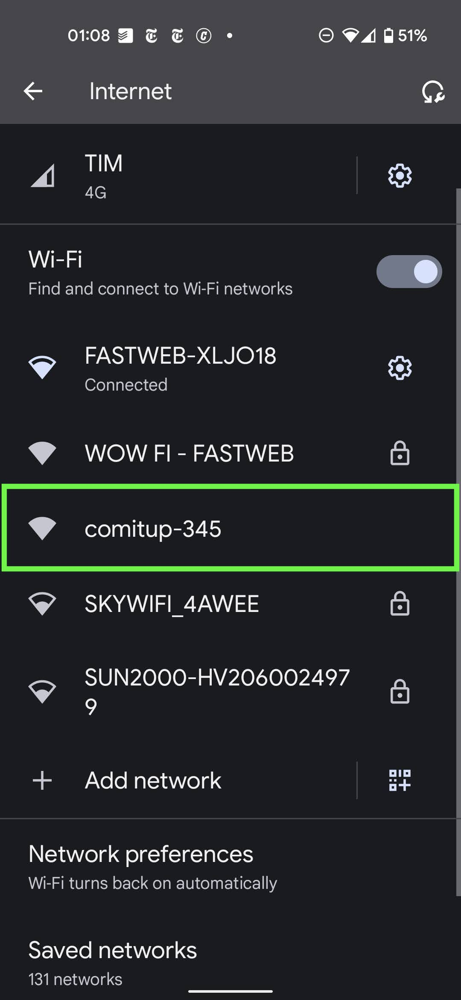
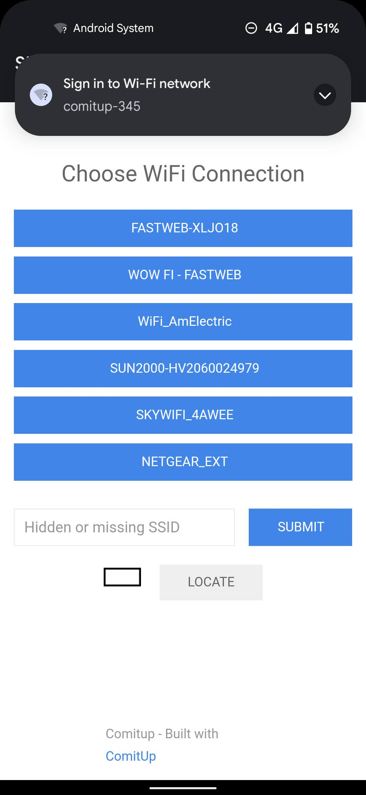
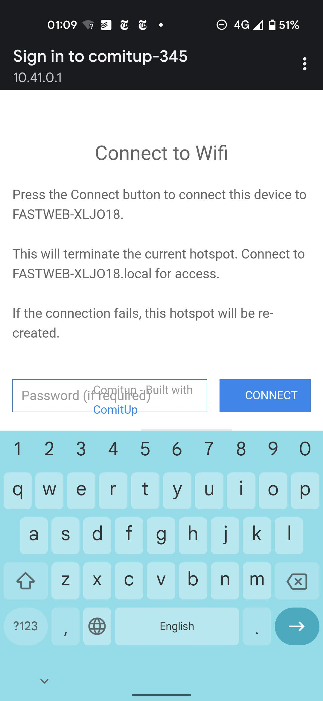

# Il Trovastelle

Il Trovastelle punta a oggetti interessanti nel cielo e sulla Terra. Sa dove trovare pianeti, lune, e asteroidi, missioni spaziali e satelliti, galassie e nebulose, e amici vicini e lontani.

[](https://www.youtube.com/watch?v=bgFfTYJVfwA)

## Come funziona

Il Trovastelle usa un accelerometro, una bussola, un giroscopio, e un orologio molto preciso per sapere dove trovare oggetti nel cielo.

[Ecco un video del Trovastelle dall'accensione alle operazioni.]( https://youtu.be/bmjY_7tN_tI )

## Configurazione

Per iniziare, collega un alimentatore da 12V[^1] con jack da 2.1mm (pin centrale positivo) al Trovastelle, e premi il pulsante di accensione.

### Connetti il Trovastelle a Internet

Il Trovastelle funziona senza alcuna connessione a Internet; tuttavia, con una connessione a Internet, può trovare anche satelliti nel cielo (per esempio, Hubble e la ISS).

Per collegare il Trovastelle a Internet, cerca una connessione WiFi aperta dal nome `comitup-XXX`.



Collegati alla rete WiFi `comitup`. Il tuo computer o telefono aprirà una finestra pop-up che ti chiede di scegliere la tua rete WiFi.



Scegli la tua rete WiFi e inserisci la password. Il Trovastelle farà sparire la rete `comitup` e si collegherà al tuo WiFi.



### Accedi al Trovastelle

Il cuore del Trovastelle è un computer Raspberry Pi con Linux. Una volta connesso il Trovastelle alla rete WiFi di casa, puoi collegarti al computer via ssh se hai le chiavi giuste:

```
ssh pi@trovastelle1.local
```

Questo comando funzionerà solamente se (i) sei sulla stessa rete WiFi del Trovastelle, e (ii) hai una chiave privata SSH corrispondente alla chiave pubblica caricata sul Trovastelle.

### Telemetria

Il Trovastelle può collegarsi al server di Federico per ricevere aggiornamenti (forse) e aiutare il debug di eventuali problemi. Questa impostazione è disattivata di default. Per attivarla, collegati al Trovastelle via SSH e usa questo comando:
```
sudo systemctl enable autossh
sudo systemctl start autossh
```
Per disattivare questa impostazione, usa questo comando:
```
sudo systemctl stop autossh
sudo systemctl disable autossh
```
Quando la telemetria è attiva, Federico può collegarsi via ssh al Trovastelle, cambiare il programma caricato a bordo, vedere le misure prese dall'accelerometro, giroscopio, e bussola, e comandare i motori, il display, e il LED.

### Progetto meccanico

Il progetto Fusion 360 è [qui](https://a360.co/3moek6k).

[^1]: I motori hanno un voltaggio nominale di 9 e 12V, e dovrebbero funzionare con qualunque voltaggio tra 9 e 18V. Il computer di bordo tollera tra 6 e 21V. Le prove sono state fatte solo a 12V.
  Il Trovastelle non consuma molto: 1A a 12V dovrebbe essere ben più che sufficiente.
